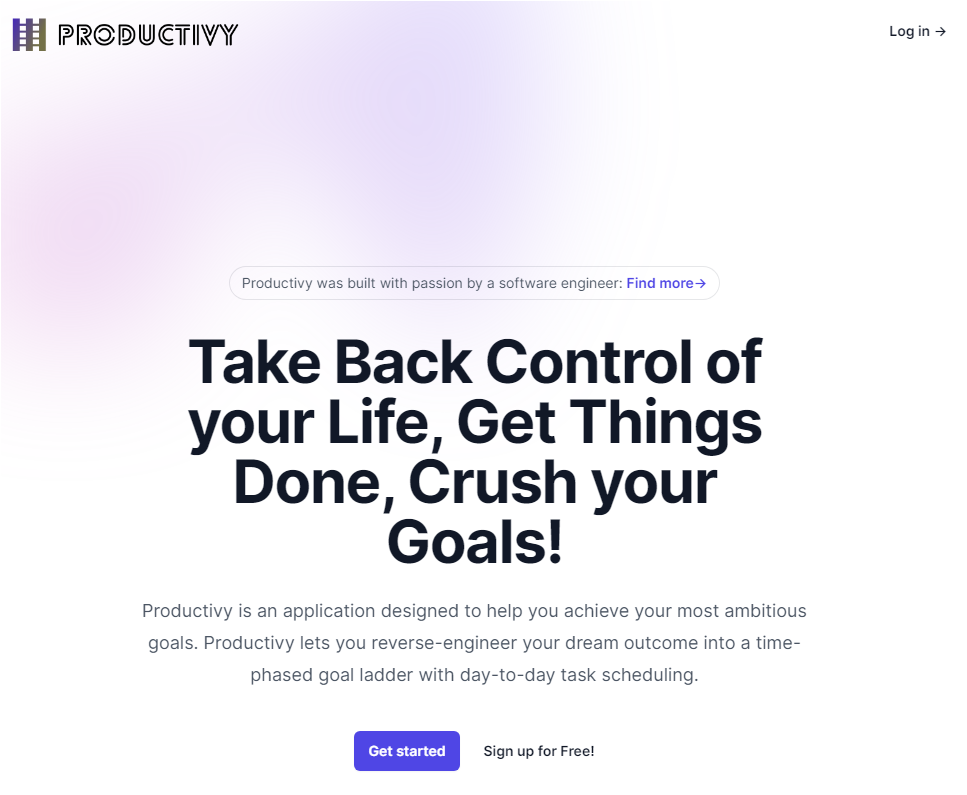

# 100HoursProject - Productivy
Welcome to my 100 hours project, this is a project where I sank in at least a 100 hours of work into it.

The project consist of a productivity web app designed to help you achieve your most ambitious goals built using the MERN stack.

Live Website: https://productivy.onrender.com/

# How it's made
Tech used: Node.js, Express, MongoDB, Tailwind CSS

This app was built from scratch using my authentication developed in my membersOnly project as the base for the code, and my previous inventory management app as the base for the application design.

# Optimization and Improvements
- Possibly switching the front end to React and vanilla CSS.
- Progress bars to show how much of the task and goals have been completed.
- Add a graph or a scoring system to encourage the user to push through his to-do list.
- Add a progress notification to let the user know his performance across each day.
- Make the todos appear in a listed way (from most important to less urgent task) in the dashboard.
- Make the goals appear in a listed way (from most important to less urgent schedule) in the dashboard.
- Fix the mobile interface so that the app buttons (edit and accomplish task/goal) works fine.

# Lessons Learned:
- This is the largest project I've built so far, using Tailwind CSS was new to me. It was a great opportunity to put into practice all what I learned so far, and show the world that I'm capable of shipping a product with potential customers problems in mind.